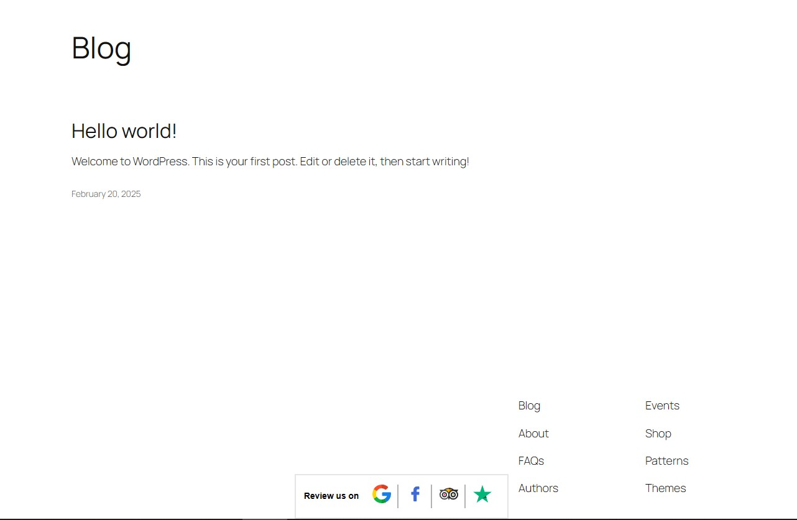
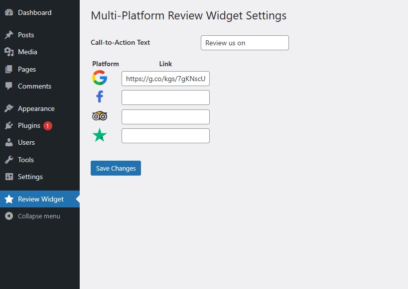

# Multi-Platform Review Widget

## Description

The Multi-Platform Review Widget is a WordPress plugin that allows you to display reviews from multiple platforms on your website. This plugin supports reviews from Google, Facebook, Tripadvisor, and Trustpilot, providing a comprehensive view of customer feedback.

## Features

- Display reviews from Google, Facebook, Tripadvisor, and Trustpilot.
- Responsive design for mobile and desktop.

### UI

### Settings

## Installation

1. Download the plugin zip file.
2. Go to your WordPress dashboard.
3. Navigate to Plugins > Add New.
4. Click on "Upload Plugin" and select the downloaded zip file.
5. Click "Install Now" and then "Activate" the plugin.

## Usage

1. After activation, go to the plugin settings page.
2. Connect your Google, Facebook, Tripadvisor, and Trustpilot accounts.
3. Customize the widget appearance and settings.

## Changelog

### 1.0.0

- Initial release.

## Credits

Developed by Pravin Singh Rana.
